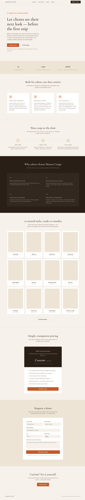
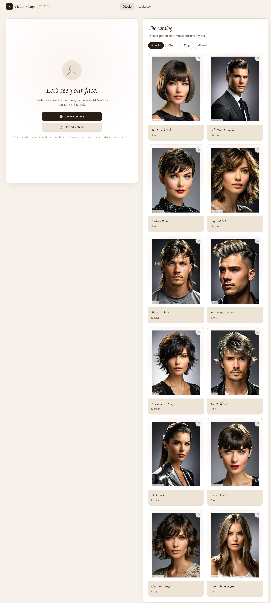

# Maison Coupe — AI Hairstyle Visualization

On-premise SDXL hairstyle visualization for professional salons.  
Clients upload a selfie, pick a style, and see a photorealistic AI preview in seconds — all processed locally, no cloud.

## Screenshots

| Landing page | Studio |
|---|---|
|  |  |

## Routes

| URL | Description |
|-----|-------------|
| `GET /` | Landing page (salon customers / sales) |
| `GET /studio` | Hairstyle studio app |
| `POST /transfer-haircut` | AI generation API |
| `GET /health` | Health check |

## Setup

```bash
# Install dependencies
uv pip install -r requirements.txt

# Set model path (or use default)
export SD_MODEL=./models/turbovisionxlSuperFastXLBasedOnNew_tvxlV431Bakedvae.safetensors

# Start
./start.sh
# or: uv run app.py
```

## POST /transfer-haircut

| Field          | Type   | Default | Notes                                              |
|----------------|--------|---------|----------------------------------------------------|
| `selfie`       | file   | —       | Subject photo (any common format)                  |
| `hairstyle`    | file   | —       | Reference haircut image (SVG silhouette or photo)  |
| `hairstyle_id` | str    | ""      | Style ID (e.g. `bob`, `wolf`). Enables caching.   |
| `prompt`       | str    | ""      | Extra descriptive text appended to prompt          |
| `strength`     | float  | adaptive| Deviation from original (0.1–0.98)                |
| `steps`        | int    | 5       | Denoising steps (clamped 3–12, inflated by strength)|
| `cfg_scale`    | float  | 2.0     | Classifier-free guidance scale (clamped 1.0–7.0)  |
| `seed`         | int    | -1      | -1 = random                                        |
| `width`        | int    | 1024    | Output width (rounded to nearest 64)               |
| `height`       | int    | 1024    | Output height (rounded to nearest 64)              |

Returns: `image/jpeg`

**Result caching:** When `hairstyle_id` is provided the server hashes the selfie and checks
`work/{selfie_hash}_{hairstyle_id}.jpg`. A cache hit returns instantly with no GPU usage.

### curl examples

```bash
# Basic usage
curl -X POST http://localhost:5000/transfer-haircut \
  -F "selfie=@selfie.jpg" \
  -F "hairstyle=@public/static/haircuts/wolf.jpg" \
  -F "hairstyle_id=wolf" \
  -o result.jpg

# With all parameters
curl -X POST http://localhost:5000/transfer-haircut \
  -F "selfie=@selfie.jpg" \
  -F "hairstyle=@public/static/haircuts/bob.jpg" \
  -F "hairstyle_id=bob" \
  -F "strength=0.85" \
  -F "steps=8" \
  -F "cfg_scale=3.5" \
  -F "seed=42" \
  -o result.jpg

# Health check
curl http://localhost:5000/health
```

## Environment variables

| Variable               | Default                              | Description                          |
|------------------------|--------------------------------------|--------------------------------------|
| `SD_MODEL`             | `./models/turbovision...safetensors` | SDXL model file                      |
| `SD_VAE`               | ""                                   | Optional external VAE                |
| `SD_WORK_DIR`          | `./work`                             | Temp + cache directory               |
| `CONTROLNET_ENABLED`   | `0`                                  | Enable Canny ControlNet conditioning |
| `SD_CONTROLNET_MODEL`  | (bundled default)                    | ControlNet model path                |
| `FACESWAP_ENABLED`     | `1`                                  | Paste original face onto result      |
| `INPAINT_ENABLED`      | `1`                                  | Inpaint for short→long transforms    |
| `HOST`                 | `0.0.0.0`                            | Flask bind address                   |
| `API_PORT`             | `5000`                               | Flask port                           |

## bin/ tools

### `bin/gen-haircut-refs`

Generates the 12 reference haircut images stored in `public/static/haircuts/`.
Run once after first setup, or to regenerate specific styles.

```bash
# Generate all 12 reference images
uv run bin/gen-haircut-refs

# Regenerate only two styles
uv run bin/gen-haircut-refs --ids bob,wolf

# List all available style IDs and their prompts
uv run bin/gen-haircut-refs --list
```

Output: `public/static/haircuts/{id}.jpg` (768×1024, JPEG quality 92)

### `bin/demo-hairstyles`

Generates pre-computed demo images for the studio's offline fallback mode.
Results land in `public/static/demo/` and are served directly by Flask as static files.
The studio loads them automatically when the inference backend is unavailable or when a
visitor hasn't uploaded a selfie.

```bash
# Generate all 12 demo results (server must be running)
uv run bin/demo-hairstyles selfie.jpg

# Reproducible seed (recommended for public demos)
uv run bin/demo-hairstyles selfie.jpg --seed 42

# Regenerate only specific styles
uv run bin/demo-hairstyles selfie.jpg --ids bob,wolf,pixie

# Custom server URL
uv run bin/demo-hairstyles selfie.jpg --url http://192.168.1.10:5000
```

Output: `public/static/demo/{id}.jpg` for each style + `public/static/demo/selfie.jpg`
(the selfie shown as the "before" image in demo mode).

### `bin/test-hairstyles`

Batch-tests all 12 hairstyles from a single selfie image against the running API server.
On re-runs with the same selfie the server returns cached images (sub-second).

```bash
# Test all styles (server must be running)
uv run bin/test-hairstyles selfie.jpg

# Custom server URL
uv run bin/test-hairstyles selfie.jpg --url http://192.168.1.10:5000

# Custom output directory
uv run bin/test-hairstyles selfie.jpg --out-dir work/my_test

# Full example
uv run bin/test-hairstyles work/portrait.jpg \
  --url http://localhost:5000 \
  --out-dir work/test_out
```

Output: `{out-dir}/{style_id}.jpg` for each style, with timing and cache/OK/FAIL status.

## Testing

```bash
# Fast unit tests (no GPU, no model files required)
pytest tests/ -v -k "not Integration and not Real"

# All tests (requires model + InsightFace models)
pytest tests/ -v

# Specific test modules
pytest tests/test_sd_cli.py -v
pytest tests/test_controlnet_faceswap.py -v
pytest tests/test_controlnet_models.py -v -k "not Real"
```

Test modules:

| File | What it tests |
|------|---------------|
| `tests/test_sd_cli.py` | API validation, unit tests for `describe_hairstyle`, `build_prompt`, `resize_to_multiple` |
| `tests/test_controlnet_faceswap.py` | Canny ControlNet conditioning + InsightFace face swap |
| `tests/test_controlnet_models.py` | ControlNet pipeline wiring, retry fallback, real model smoke tests |

## Tuning

| Goal                              | Adjustment                          |
|-----------------------------------|-------------------------------------|
| Keep more of the original face    | Lower `strength` (0.4–0.55)         |
| More dramatic hair change         | Raise `strength` (0.70–0.90)        |
| Faster inference                  | Lower `steps` (3–5), or reduce size |
| Better quality                    | Raise `steps` (8–12), lower CFG     |
| Short → long transformation       | Set `INPAINT_ENABLED=1` (default)   |
| Face preservation                 | Set `CONTROLNET_ENABLED=1`          |
